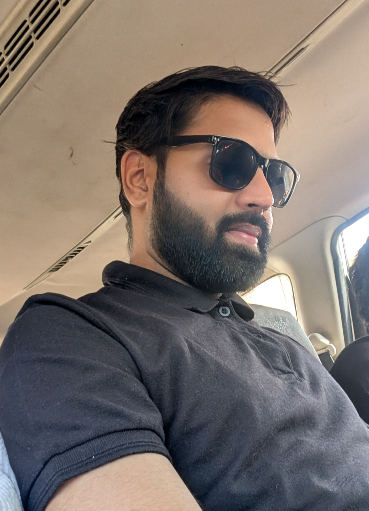

<!DOCTYPE html>
<html lang="en">
<head>
    <meta charset="UTF-8">
    <meta name="viewport" content="width=device-width, initial-scale=1.0">
    <meta name="description" content="Portfolio of Sureshkumar Kaneriya - Quality & Technical Inspection Professional">
    <title>Sureshkumar Kaneriya | Professional Portfolio</title>
    
    <!-- Google Fonts & Icons -->
    <link href="https://fonts.googleapis.com/css2?family=Plus+Jakarta+Sans:wght@300;400;500;600;700&display=swap" rel="stylesheet">
    <link rel="stylesheet" href="https://cdnjs.cloudflare.com/ajax/libs/font-awesome/6.4.0/css/all.min.css">
    
    
</head>
<body>

    <main class="portfolio-container">

        <!-- LEFT SIDE: Profile Card -->
        <aside class="sidebar-card">
            

                
            

            
            <h1>SURESHKUMAR KANERIYA</h1>
            
Quality & Technical Inspection Professional Solar PV Manufacturing

            
<i class="fa-solid fa-location-dot" style="color: #ef4444;"></i> Surat, Gujarat, India

            

                <a href="mailto:ksuresh0261@gmail.com" class="btn btn-primary"><i class="fa-solid fa-paper-plane"></i> Contact Me</a>
                <a href="tel:+918320256171" class="btn btn-secondary"><i class="fa-solid fa-phone"></i> +91 83202 56171</a>
                <a href="https://www.linkedin.com/in/sureshkumar-k-34267719a" target="_blank" rel="noopener noreferrer" class="btn btn-secondary"><i class="fa-brands fa-linkedin"></i> LinkedIn Profile ↗</a>
            

        </aside>

        <!-- RIGHT SIDE: Resume Information -->
        

            <!-- Profile Summary -->
            <section class="card-section about-card">
                <h2><i class="fa-solid fa-user-check"></i> Profile Summary</h2>
                

                    Results-driven Quality & Technical Inspection professional with <b>7+ years of experience</b> in Solar PV module manufacturing, IPQC/PDI management, and third-party inspections. Managed quality inspection programs for <b>500+ MW</b> of solar projects. Experienced in IEC 61215/61730 standards, ISO/IEC 17020 compliance, and drone thermography using Agisoft Metashape & QGIS.
                

            </section>

            <!-- Core Competencies -->
            <section class="card-section skills-card">
                <h2><i class="fa-solid fa-gears"></i> Core Competencies</h2>
                

                    IPQC & PDI Inspection
                    IEC 61215 / IEC 61730
                    ISO/IEC 17020 & NABCB
                    Vendor Evaluation
                    Inline & FQC Inspection
                    BOM Verification
                    Drone Thermography
                    Agisoft Metashape & QGIS
                    Defect Analysis
                    SOP Development
                

            </section>

            <!-- Experience -->
            <section class="card-section exp-card">
                <h2><i class="fa-solid fa-briefcase"></i> Work Experience</h2>
                
                

                    
Assistant Manager – Technical Inspection

                    
JSR Photonics LLP, Surat

                    
Oct 2024 – Present

                    <ul class="exp-bullets">
                        <li>Managed Solar PV module IPQC, inline inspection, and PDI for 500+ MW projects.</li>
                        <li>Lead customer/OEM coordination, vendor evaluations, and SOP development.</li>
                        <li>Executed drone thermography plant inspections using Agisoft Metashape & QGIS.</li>
                    </ul>
                

                

                    
Jr. Engineer – Quality Department

                    
Goldi Solar Pvt. Ltd., Surat

                    
Feb 2022 – Oct 2024

                    <ul class="exp-bullets">
                        <li>Conducted process audits, defect analysis, and module reliability testing.</li>
                        <li>Managed ISO documentation, DQRs, and Final Quality Control (FQC).</li>
                    </ul>
                

                

                    
Quality Engineer – Merlin Dept.

                    
Waaree Energies Ltd., Surat

                    
Feb 2019 – Feb 2022

                    <ul class="exp-bullets">
                        <li>Inspected flexible & foldable Solar PV modules manufactured using Merlin technology.</li>
                    </ul>
                

                

                    
Trainee Engineer – Quality Dept.

                    
Sonali Solar Pvt. Ltd., Surat

                    
Jul 2018 – Dec 2018

                    <ul class="exp-bullets">
                        <li>Handled Line QC, EL testing, visual inspection, and daily quality records.</li>
                    </ul>
                

            </section>

            <!-- Licenses & Education -->
            <section class="card-section edu-card">
                <h2><i class="fa-solid fa-graduation-cap"></i> Education & Licenses</h2>
                

                    

                        <h4>B.E. in Electrical Engineering</h4>
                        
CKPCET, Surat (GTU) | CGPA: 7.81 (2016)

                    

                    

                        <h4>Electrical Supervisor Permit</h4>
                        
Approved by Govt. of Gujarat (Feb 2020)

                    

                    

                        <h4>ISO/IEC 17020 Certification</h4>
                        
Inspection Body Requirements & Audits

                    

                    

                        <h4>HSC (12th) & SSC (10th)</h4>
                        
GSEB | 12th: 63% | 10th: 73%

                    

                

            </section>

            <!-- Projects & Industrial Training -->
            <section class="card-section cert-card">
                <h2><i class="fa-solid fa-diagram-project"></i> Key Projects & Training</h2>
                

                    

                        <h4>B.E. Final Year Project</h4>
                        
Microcontroller-Based Prototype of Underground Fault Detector

                    

                    

                        <h4>Industrial Internships</h4>
                        
Utran Power Plant & Surat District Milk Producers Union

                    

                

            </section>

        

    </main>

</body>
</html>
